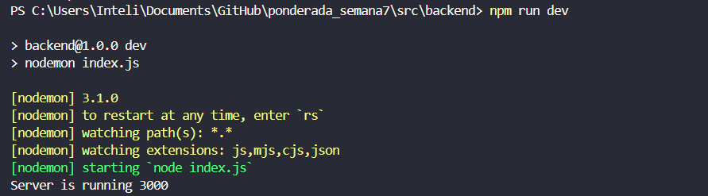
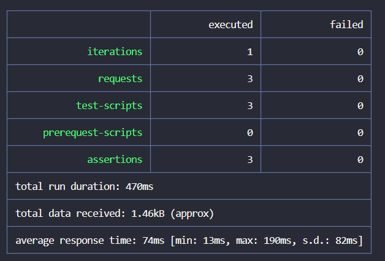
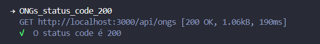
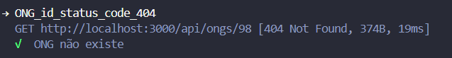
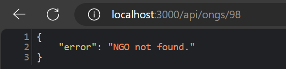
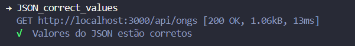

## Caso de Teste de Software

### 📖 Descrição
Essa atividade contempla 3 casos de teste relacionado as ONGs do projeto Asas Solidárias para a Gerando Falcões. Esses testes foram pensados e projetados para abranger casos de acerto e de erro do sistema, visando garantir a funcionalidade de todo o sistema. 

**Caso de teste 1: Listagem de todas as ONGS**
Este caso de teste verifica se a consulta das ONGs existentes no sistema é realizada com sucesso.

**Caso de teste 2: Listagem de uma ONG não existente**
Este caso de teste verifica se a consulta de uma ONG não existente no sistema retorna uma mensagem de erro apropriada.

**Caso de teste 3: Verificação de dados retornados**
Este caso de teste verifica se a resposta da consulta das ONGs existentes é retornada em formato JSON com os valores correspondentes aos registrados no sistema.

### 🔹Pré-condição 
Para que esses testes sejam realizados com sucesso, é necessário que algumas condições sejam atendidas:
- O servidor da API deve estar em execução. Para inicializá-lo, entre no diretório `.cd \src\backend`, instale as dependências com `npm i` e execute o comando `npm run dev`;
- Deve haver a verificação da implementação das rotas `api/ongs` e `api/ongs/:id`;
- O banco de dados deve estar com alguns dados de teste;
- A ferramenta Newman deve estar instalada. É possível instalá-la globalmente com o comando `npm install -g newman` no terminal. 

 Figura 1 - Execução do servidor (Passo 1) 

 Fonte: Material produzido pela autora (2024) 

### 🔹Procedimento de Teste
Com as pré-condições atendidas, é possível iniciar o procedimento de teste com os seguintes passos:

1. Abra o terminal e certifique-se estar dentro do diretório `.\src\backend`;
2. Digite o comando `newman run Ponderada.postman_collection.json` no terminal;
3. Aguarde o resultado dos testes.

 Figura 2 - Procedimento de teste 

 Fonte: Material produzido pela autora (2024) 

   
### 🔹Pós-condição 
Ao executar o procedimento de teste, algumas pós-condições também precisam ser atendidas:
- O servidor deve continuar em execução sem ocorrer nenhuma falha;
- Os resultados dos testes devem ser exibidos no terminal;
- Se não existir dados de teste no banco de dados, a resposta deve ser uma lista vazia, sem ocasionar erro na execução do servidor;
- A estrutura do JSON deve estar de acordo com a especificação da API.

### 🔹Resultados esperados e obtidos
Foram executados os 3 testes de API em 470ms. Esses testes foram realizados em 1 iteração, com 3 requests divididos em testes scripts. Abaixo está descrito o resumo dos testes fornecidos pelo Newman e os resultados esperados e obtidos por cada um dos testes realizados.

 Figura 3 - Resultado do teste 1 

 Fonte: Material produzido pela autora (2024) 

#### Caso de teste 1: Listagem de todas as ONGS

**Endpoint:** `GET /ongs`

**Response** `ONGs_status_code_200`

**Resultado Esperado:**

- Código de status `200 Ok`.

**Resultado Obtido:**
O primeiro caso passou no teste, recebendo o status code 200. Isso significa que é possível listar normalmente as ONGs registradas no sistema.
- Código de status `200 OK`.

 Figura 4 - Resultado do teste 1 

 Fonte: Material produzido pela autora (2024) 

#### Caso de teste 2: Listagem de uma ONG não existente
**Request:** ONG_id_status_code_404

**Endpoint:** `GET /ongs/:id`

**Resultado Esperado:**

- Código de status `404 Not Found`
- Mensagem `NGO not found.`

**Resultado Obtido**
O segundo caso de teste passou no teste, recebendo o status 404. Isso significa que quando é feita a consulta de uma ONG não registrada, o sistema devolve o status code apropriado e uma mensagem informando que aquela ONG não foi encontrada: "NGO not found".

- Código de status `404 Not Found`
- Mensagem `NGO not found.`

 Figura 5 - Resultado do teste 2 

 Fonte: Material produzido pela autora (2024) 

 Figura 6 - Mensagem retornada para o usuário 

 Fonte: Material produzido pela autora (2024) 

#### Caso de teste 3: Verificação de dados retornados

**Request:** JSON_correct_values

**Endpoint:** `GET /ongs`

**Resultado Esperado**

- A resposta deve ser uma lista de objetos, em que cada um contém: `id`, `name`, `email`, `cnpj`, `telephone`, `foundationData` e `address`.

**Resultado Obtido**
O terceiro caso também passou no teste, isso significa que quando é feita a consulta das ONGs, o sistema devolve a resposta em uma lista de objetos. Esses objetos devem possuir os mesmos valores já determinados no model da entidade.

- A resposta é uma lista de objetos, em que cada um contém: `id`, `name`, `email`, `cnpj`, `telephone`, `foundationData` e `address`.

 Figura 7 - Resultado do teste 3 

 Fonte: Material produzido pela autora (2024) 

### 📘Conclusão
O teste de software é uma técnica fundamental para verificar a funcionalidade do sistema. Os casos descritos nesse documento mostram a funcionalidade da devolução correta do status code para a listagem de ONGs existentes e não existentes, e da construção correta do corpo da resposta na listagem das ONGs. 

Os resultados positivos obtidos informam que a API está funcionando conforme o esperado. Para garantir a funcionalidade contínua,  é necessário que esses testes sejam refeitos periodicamente de acordo com as mudanças feitas no sistema e nos requisitos.

### 📁 Estrutura de pastas

Dentre os arquivos presentes na raiz do projeto, definem-se:

- <b>readme.md</b>: explicação geral sobre o projeto (o mesmo que você está lendo agora).

- <b>src</b>: aqui estarão todos os arquivos do projeto.

- <b>imagens</b>: aqui estarão todas as imagens utilizadas nessa socumentação.